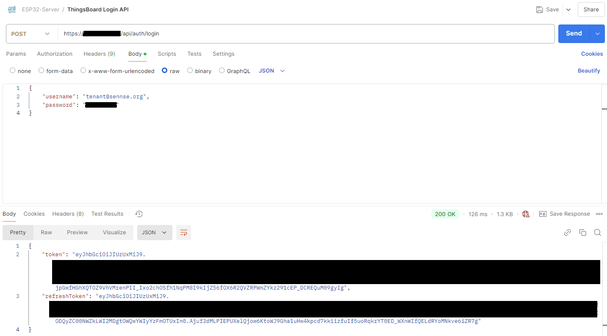
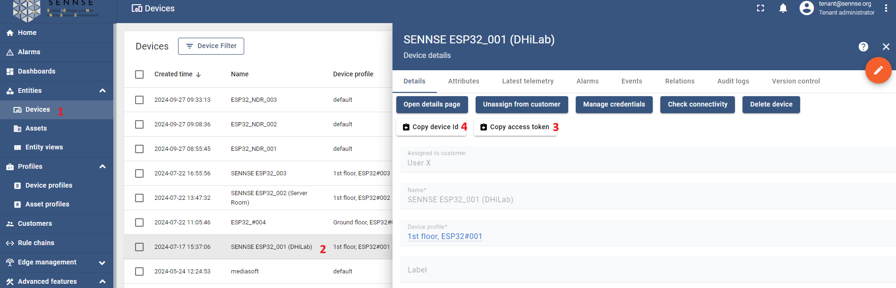
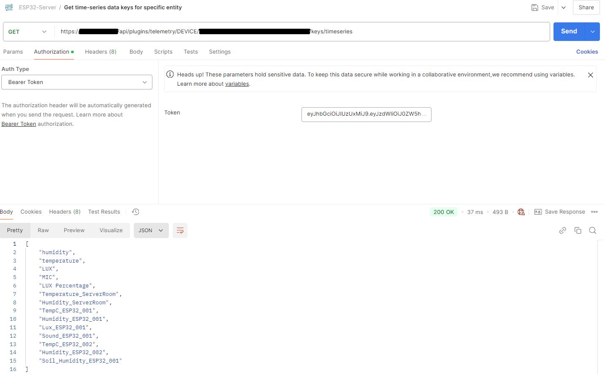
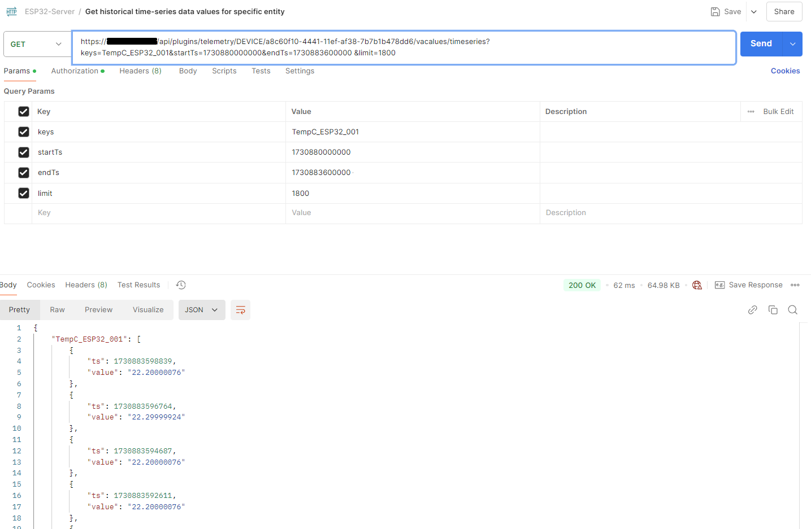

# SENNSE: Retrieve Time-Series Data for a Specific Entity

## Overview
This tutorial demonstrates how to retrieve time-series data from SENNSE for a specified device and time range.
All screenshots in this guide are taken from the SENNSE Docker version deployed on ISPC-Lecce Server. Due to security considerations, authentication credentials are not provided here, but they are the same as previously shared.

## Objective
The objective of this tutorial is to obtain data from a sensor within a specific time range. For demonstration purposes,  we will retrieve the temperature values recorded by a sensor between **09:00 AM and 10:00 AM on November 6, 2024**.

## Prerequisites
- **SENNSE Platform**: Access to the SENNSE Docker version.
- **Authentication Credentials**: Use the credentials previously provided.

---

## Steps
### Step 1: Obtain Device Access Token & Device ID
1. **Navigate to the Entity Section**:
   - In the SENNSE platform, go to **Entity > Devices**.
   
2. **Select Your Device**:
   - Locate and select the device you wish to query.
   
3. **Copy Device ID**:
   - Copy and securely save the **Device ID** for later use.

> **Note**: This tutorial supports Postman as the API testing tool, but any alternative tool can be used. A comprehensive list of ThingsBoard APIs is available [here](https://demo.thingsboard.io/swagger-ui/index.html).

 

### Step 2: Authenticate with ThingsBoard API

1. **Create a Login Request**:
   - Set up a `POST` request with the following URL:
     ```
     https://XXX.XXX.XX.XXX/api/auth/login
     ```
   
2. **Define the Credentials**:
   - In the **Body** section, provide a JSON object with the required authentication credentials.
   
3. **Save the Access Token**:
   - Upon successful authentication, copy and save the access token from the response.

 

### Step 3: Retrieve Time-Series Data Keys

1. **Create a GET Request for Keys**:
   - Set up a `GET` request with the following URL, replacing `{Device_ID}` with your actual Device ID:
     ```
     https://XXX.XXX.XX.XXX/api/plugins/telemetry/DEVICE/{Device_ID}/keys/timeseries
     ```
   
2. **Set Authorization**:
   - Go to the **Authorization** section and select `Bearer Token` as the **Auth Type**.
   - Paste the token retrieved from the login response into the **Token** field.
   
3. **Choose Data Key**:
   - Select the data key `TempC_ESP32_001` to retrieve temperature values.



### Step 4: Retrieve Historical Time-Series Data

1. **Create a GET Request for Historical Data**:
   - Set up a `GET` request with the following URL, replacing `{Device_ID}` with your Device ID:
     ```
     https://XXX.XXX.XX.XXX/api/plugins/telemetry/DEVICE/{Device_ID}/values/timeseries?keys=TempC_ESP32_001&startTs=1730880000000&endTs=1730883600000&limit=1800
     ```
   
2. **Set Authorization**:
   - In the **Authorization** section, select `Bearer Token`.
   - Paste the token from the login response.

3. **Define Parameters**:
   - In the **Params** section, set up the following key-value pairs:
     - `keys`: `TempC_ESP32_001`
     - `startTs`: `1730880000000` (represents 09:00:00 on November 6, 2024)
     - `endTs`: `1730883600000` (represents 10:00:00 on November 6, 2024)
     - `limit`: `1800`

> **Note**: 
> - `startTs` and `endTs` are Unix timestamps, representing the start and end of the desired time range. For instance, `1730880000000` corresponds to **6 November 2024 09:00:00**.
> - The `limit` specifies the maximum number of values returned. With data being sent every 2 seconds, **1 hour** yields approximately **1800 records**.



---

This guide provides a step-by-step process for retrieving time-series data from SENNSE. Use it to monitor and analyze your device's data at any desired timeframe.
